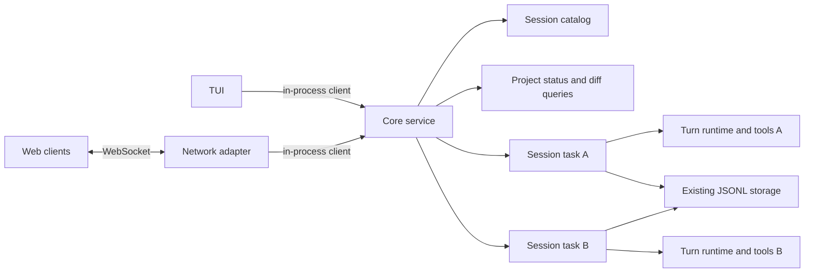

Make the core a long-lived service inside the existing binary. The TUI connects
through Rust channels; remote clients connect through a WebSocket adapter to the
same service. Both use the same commands, snapshots, and events.

This is an implementation plan based on commit `d655c9c`, dated 2026-09-16.
Confirmed choices: shared control of sessions, messages during a running turn
become steers, and one project directory per server. Assume all connected
clients belong to the same trusted user.



The useful starting point is already present: `runtime::spawn` returns a command
sender and an event receiver. Extend that boundary before introducing networking.

| Current coupling | Required change |
| --- | --- |
| [runtime/mod.rs](/projects/Rope/src/runtime/mod.rs:302) owns one session and replaces it on new/resume | A registry owns one task per loaded session; selecting a session only changes a client's subscription |
| [ui/mod.rs](/projects/Rope/src/ui/mod.rs:1171) inserts user/steer messages locally and handles approval markers locally | The core publishes accepted messages and approval decisions to every subscriber |
| [ui/mod.rs](/projects/Rope/src/ui/mod.rs:1068) reads the session directory directly | Clients obtain the shared catalog through the core |
| [ui/state.rs](/projects/Rope/src/ui/state.rs:1099) assembles the only complete live transcript | Extract a terminal-independent state projection that can produce snapshots mid-turn |
| [tool/mod.rs](/projects/Rope/src/tool/mod.rs:178) builds a registry whose clones share mutable tool instances | Create mutable tool resources per session; clones within that session may still share them |
| [project.rs](/projects/Rope/src/project.rs:14) includes a selected diff path in shared project state | Broadcast project status; return requested diffs only to the requesting client |
| [config.rs](/projects/Rope/src/config.rs:286) persists model selection alongside UI preferences | Separate server configuration, session settings, and client preferences |
| [runtime/message.rs](/projects/Rope/src/runtime/message.rs:5) skips image bytes during serialization | Use an explicit attachment API and wire references instead of serializing storage messages directly |

Keep this in one Cargo package. Add a library target for core integration tests
and keep `main.rs` as the composition root. A sufficient module layout is:

```text
src/lib.rs             module exports for the binary and integration tests
src/protocol.rs        shared commands, replies, events, snapshots, public types
src/core/mod.rs        service handle, client connections, catalog, routing
src/core/session.rs    one session's command loop and lifecycle
src/core/state.rs      authoritative live transcript and snapshot projection
src/server.rs          HTTP/WebSocket adapter and authentication
src/runtime/          existing model/tool turn execution
src/session.rs        session storage and attachment storage
src/project.rs        project status and diff queries
src/ui/               TUI client, input handling, rendering, local preferences
```

Use concrete structs, enums, functions, and Tokio channels. The local client can
be a small handle with request and subscription methods. A general transport
trait, additional crates, database, or plugin framework is unnecessary for this
change. Network code and terminal code must not become dependencies of the core.

State ownership determines the behavior:

| Owner | State |
| --- | --- |
| Core service | Immutable project root, provider configuration and credentials, public model catalog, session catalog, session tasks, project status |
| Session task | Conversation, active turn, queued steers, pending approval, model/reasoning settings, plan, usage, tool resources, persistence |
| Client | Selected session, draft text/images, scroll, selection, collapsed blocks, search, pane layout, selected diff, clipboard, terminal capabilities, prompt/command history |

Each session task serializes its commands and state changes. It launches model
requests and tools as worker tasks, so slow I/O does not prevent subscriptions,
cancellation, or approval handling. Manual compaction must also become a tracked
worker operation: its current implementation awaits the provider inside the
command loop.

Runtime workers send changes back through the session task, tagged with a turn
or operation ID. That task updates authoritative state before publishing an
event. Late events from a cancelled or replaced operation cannot update the next
turn. This replaces the current split between direct UI events and internal
runtime events with one ordered publication path.

The shared-control rules should be explicit:

- There is at most one active turn per session. Different sessions can run
  independently against the server's project directory. They share project
  files; this change does not add worktrees or isolation between file edits.
- Expose one `SendMessage` command. The core decides whether it starts a turn or
  queues a steer using its current state, then broadcasts the accepted message
  and its assigned ID. Two simultaneous submissions become a first prompt and a
  steer in server acceptance order. Neither is silently ignored.
- Preserve existing steer semantics: inject at the next model request, start a
  follow-up turn for steers that missed the final request, and retain queued
  steers when cancelling. Include queued/delivered status in live state.
- Address approval decisions by session, turn, and approval ID. The first valid
  decision wins; broadcast `ApprovalResolved` to clear every client's prompt.
  A late decision returns `stale_approval` and cannot approve a later call.
  `AllowSession` applies only to that session.
- Address cancellation by turn/operation ID, so a delayed cancel cannot stop a
  newer turn. All clients see the same cancellation and retained partial output.
- Model and reasoning settings belong to the session. Use explicit setters,
  validated against a settings revision, instead of a remote "next" command.
  Settings changes and manual compaction return `busy` during another operation.
  A message submitted during manual compaction returns `busy` with its draft
  retained; automatic compaction inside a turn continues to accept steers.
- Creating a session broadcasts a catalog change and returns its identity.
  Opening or leaving a session only subscribes or unsubscribes that client.
  Clients can switch away while work continues. Disconnecting the last viewer
  does not cancel work; unresolved approvals remain waiting for a client.
- Command rejection is a reply to the requester. A failed model/tool operation
  is a shared session event. A stale action must not put everyone else's
  session into an error state.

The public protocol should consist of ordinary Serde data types. Keep internal
oneshot senders, task handles, and lifecycle commands outside these types.

| Message family | Contents |
| --- | --- |
| Hello | Protocol version, authentication, resumable client identity; reply includes a server-instance ID and public capabilities |
| Catalog subscription | Initial session list, then created/updated session summaries including activity, title, first-message summary, and usage |
| Session subscription | Session ID; reply supplies a complete snapshot and a subscription identity |
| Mutations | Request ID, session ID, command and payload; turn/approval/settings IDs where applicable |
| Replies | Request ID and accepted result or a structured error code and message |
| Events | Subscription/topic, sequence number, session ID when relevant, typed payload |
| Queries | Public model catalog, project status, and a requested git diff; diff results are requester-specific |

Use strings for request and object IDs, explicit millisecond fields for timing,
and tagged enums with stable wire names. Retain session directory names as stable
session IDs; generated titles remain display text. Give transcript entries and
streaming tool drafts stable IDs within the server instance. Tool-call indexes
alone are insufficient because they repeat on each model request. IDs should
also let clients preserve scroll and collapse state when refreshing a snapshot.

Keep provider replay items and credentials private. The client receives a public
session view, not `Config`, raw provider responses, or serialized `UiState`.
Represent timing with elapsed durations and running/paused state so a new client
does not restart displayed timers at zero.

A snapshot must include completed transcript content and the entire live tail:
partial assistant/reasoning text, draft tool arguments, streamed tool output,
tool results and images, active operation, queued steers, pending approval,
settings, plan, usage, and context state. Extract the domain parts of the existing
UI reducer into `core/state.rs`; rendering caches and presentation choices stay
in the TUI. The projection must preserve cancelled and failed partial output as
well as successful responses.

Use snapshot-plus-events for synchronization:

1. The owning task handles subscription as one operation: register a receiver
   and capture immutable state at sequence `N` without a concurrent mutation.
2. The adapter sends that snapshot before delivering events after `N`. Large
   snapshots use bounded chunks with a common snapshot ID and a final marker;
   the client installs the snapshot only when complete.
3. Apply events in sequence. Maintain independent sequence numbers for catalog,
   project, and session topics; there is no required ordering across topics.
4. A reconnect or missing sequence obtains a fresh snapshot, including an active
   turn. Reset cursors when the server-instance ID changes. Durable event replay
   is unnecessary for the first version.

Use bounded broadcast channels and bounded socket output queues. Never await a
slow socket from the core. On lag, invalidate the subscription and require a new
snapshot; if the connection cannot deliver that response, close it. Do not
silently skip transcript deltas. Tokio broadcast explicitly reports dropped
events as `RecvError::Lagged`, which provides the trigger for this policy.
([Tokio broadcast documentation](https://docs.rs/tokio/latest/tokio/sync/broadcast/index.html))

Bound individual payloads as well as queue lengths, and batch adjacent text
deltas when needed while preserving their order. Browser WebSockets do not
provide receive-side backpressure, so client rendering should also batch updates
and recover through resubscription when it cannot keep up.
([Browser WebSocket documentation](https://developer.mozilla.org/en-US/docs/Web/API/WebSocket))

Mutations need request deduplication across reconnects. Keep a bounded reply cache
under a resumable client identity for the current server instance. Use increasing
per-client request numbers, encoded as strings, and remember the highest accepted
number while that identity is valid. Record pending requests before dispatch.
Repeating a known request returns its original outcome; reusing its number with
another payload is an error. An expired identity or an old request whose reply
was evicted returns an indeterminate/expired result rather than executing again.
Clients reconcile through a snapshot and never automatically resend uncertain
mutations after a server restart. An accepted reply means accepted by the live
core, not a promise of crash durability.

Keep the current session storage location and JSONL format readable. Add optional,
backward-compatible metadata for project root and session model/reasoning
settings. Allocate automatic names with atomic directory creation and collision
retry. Hold an OS-backed exclusive lock while a session is loaded so another
Rope process cannot become its second writer; fail clearly if it is already owned.

Bind new sessions to the server's canonical project root. The proposed catalog
contains sessions for that project plus clearly marked legacy sessions with no
recorded root. Explicitly opening a legacy session binds it to the current project
under its session lock; known sessions from another project are rejected. This
preserves access to old sessions without silently executing a known foreign
session in the wrong directory. Pass the root into config loading, tool discovery,
project operations, and external-tool execution; never change process cwd to
implement a client request.

Persist session settings separately from client recency/history preferences.
Replace session metadata atomically. Preserve the existing turn-boundary
persistence and cancellation recovery initially; a server crash may lose
uncommitted live output. Graceful shutdown must cancel and join active operations,
retain interrupted work through the existing recovery path, terminate tool process
trees, flush storage, and report persistence errors. Exact recovery of an active
turn after a process crash is a separate feature.

Give every loaded session its own shell-job manager and lazy browser context.
Otherwise ending a turn in session A can cancel jobs belonging to session B through
the cloned registry. Stateless provider HTTP clients can still be shared. Load
session tasks lazily and retain their state for the service lifetime in the first
version. This also preserves live partial/error output across detach and reattach
without adding a durable event store. Actor eviction can follow later if memory
usage requires it, once every retained transcript item has a reloadable form.

Images need a small HTTP upload/download API alongside WebSockets. Store bytes
through the core and put opaque attachment IDs, MIME types, and dimensions in
snapshots/events. The in-process TUI calls the same storage operations directly;
a browser uploads local bytes instead of sending local filesystem paths. Resolve
attachments for provider requests on the server. Load existing disk attachments
through the same mapping, and publish tool-produced images before referencing
them in events. Authenticate attachment requests and constrain them to stored
attachments; do not expose arbitrary file paths.

Use one WebSocket endpoint for commands, replies, and streamed events. Axum is a
small addition to the existing Tokio/Serde stack and provides WebSocket upgrades
and separate read/write handling. Keep its adapter limited to authentication,
decoding, routing, encoding, and connection lifetime.
([Axum WebSocket documentation](https://docs.rs/axum/latest/axum/extract/ws/index.html))

Proposed invocation modes:

```sh
rope                                      # embedded core and TUI, no listener
rope --listen 127.0.0.1:8787                # same core with TUI and remote clients
rope --headless --listen 127.0.0.1:8787     # core and remote clients, no terminal UI
```

Keep positional startup requests and `--session NAME` working in embedded mode.
Headless mode can start with an empty catalog and must never create a session just
because the process starts. If an explicit startup request is supplied, create or
open its target session and submit it through the same core command path.

The process owns service shutdown. In ordinary embedded mode, exiting the TUI
also ends its privately owned core. With a listener enabled, exiting the TUI
detaches it and leaves the foreground server running; print the listening address
and shutdown instruction. Closing a WebSocket always just detaches that client.
Process signals initiate service shutdown; there is no public WebSocket shutdown
command. Missing configuration in headless mode produces an actionable error
instead of launching interactive onboarding, and no terminal or clipboard APIs
are initialized there.

Default the listener to loopback and require a server token for network clients.
Use an environment variable or private token file. A browser can send the token
in the initial authentication frame, before receiving data or issuing commands;
bound unauthenticated message size and time. Validate WebSocket Origin against an
explicit allowlist, and configure HTTP attachment origins consistently. Keep
tokens out of URLs and logs. Remote exposure uses HTTPS/WSS through a reverse
proxy. All authenticated clients have the same session permissions in this scope.

Implement in these reviewable steps:

1. **Define the boundary.** Add the library target, public protocol/state types,
   explicit project-root arguments, and separate client preferences from server
   configuration. Document shared-control semantics and wire examples. Keep
   storage messages and provider payloads distinct from public views.
2. **Extract the single-session service.** Move lifecycle/state ownership into
   `core/session.rs` and `core/state.rs`, route runtime changes through it, and
   adapt the TUI to the local client handle. Move message acceptance and approval
   markers into the core. Remove direct session-storage reads from the UI. Preserve
   normal startup, streaming, steering, cancellation, compaction, images, and exit
   summaries before expanding to multiple sessions.
3. **Support multiple sessions and subscribers.** Add the registry, catalog
   subscription, atomic session snapshots, ordered fan-out, scoped tool resources,
   session locks, and shared action arbitration. Make selected sessions and diff
   views client-local. Prove two independent in-process clients can share one
   active session before introducing networking.
4. **Add the network adapter and headless lifecycle.** Implement WebSocket routing,
   token/Origin handling, attachment HTTP routes, bounded queues, reconnect
   snapshots, request deduplication, CLI modes, and signal-driven shutdown. Exercise
   the same core behavior through the network adapter; do not introduce a second
   runtime or business-logic path. Add Axum's WebSocket support and Tokio's network
   and signal features to `Cargo.toml`.
5. **Validate compatibility and document delivery.** Add concurrency/transport
   integration tests, wire-format fixtures, a minimal browser connection example,
   and CLI/protocol documentation. Update `FEATURES.md` as features land, plus
   `README.md` and `BUILDING.md` for changed startup and browser-context behavior.

Use the existing mock provider and temporary session roots for deterministic
integration tests. The acceptance cases are:

- Two clients observe the same catalog creation, title, activity, and usage
  updates, and the same transcript while sharing a session.
- Simultaneous messages produce one turn and ordered steers, with no duplicate
  user messages; simultaneous session creation produces unique identities.
- A client attaches during text generation, tool output, retry, compaction, or
  an approval wait and gets complete state followed by every subsequent event.
- Two clients answer one approval; exactly one decision takes effect. A stale
  approval or cancel cannot affect a later tool or turn.
- Switching sessions or disconnecting every client leaves work running. A later
  client can reconnect and continue controlling it.
- Cancelling or finishing session A cannot stop session B's shell/browser work;
  clients requesting different diffs do not overwrite each other's view.
- A slow client cannot block generation or another client. Snapshot/subscribe
  races, lag, and reconnection restore state without omissions or duplication.
- Repeating an accepted request after a lost reply does not repeat its effect;
  expired retries and server restarts return an explicit uncertain outcome.
- Existing session JSONL, plans, usage, approvals, and image attachments load;
  a second process cannot write an owned session; project binding is enforced.
- Headless startup and shutdown work without a TTY. Shutdown reaps process trees
  and preserves interrupted work. Invalid auth/origins and oversized payloads
  are rejected, and no provider secret appears in a public snapshot.

Run `cargo test --locked` and `cargo fmt --check` after implementation. Keep the
existing Linux/macOS/Windows build targets and add appropriate smoke coverage for
file locking and process shutdown on those platforms. The full web application,
a remote-TUI connection mode, multiple projects per server, user roles, automatic
server discovery, and durable event replay can be separate follow-up work.
